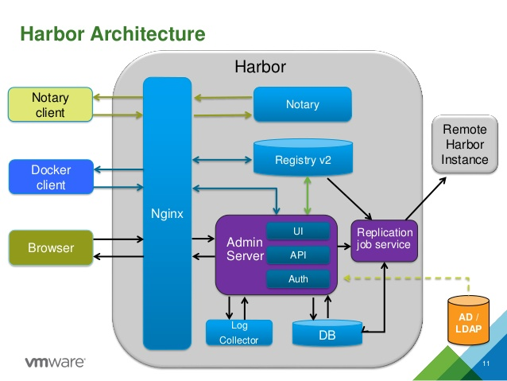

# Harbor Helm

Harbor is an open source cloud native registry that provides trust, compliance, performance, and interoperability. As a private on-premises registry, Harbor fills a gap for organizations that cannot use a public or cloud-based registry or want a consistent experience across clouds. [Harbor Wiki](https://github.com/goharbor/harbor/wiki)


## Setup

1. Harbor Architecture:

    

1. Clone and Create namespace

    ```console
    cd ~/
    git clone -b 1.0.1 https://github.com/goharbor/harbor-helm
    cd harbor-helm
    ```

    ```console
    kubectl create ns harbor
    ```

    ```console
    kubens
    ```

    Output:
    ```console
    default
    harbor
    kube-public
    kube-system
    ```

    ```console
    kubens harbor
    ```

    Output:
    ```console
    Context "simple.k8s.local" modified.
    Active namespace is "harbor".
    ```

1. Configure name and tls configuration.

    We will define the variables for harbor and save them. Also we will use the variables for cert and key.
    ```shell
    echo '## Harbor Variables' >> ~/.bashrc
    echo 'export HARBOR_CORE=core.$KUBE_IP.nip.io' >> ~/.bashrc
    echo -e 'export HARBOR_NOTARY=notary.$KUBE_IP.nip.io\n' >> ~/.bashrc
    bash -l
    kubectl create secret tls ${CERT_NAME} --key ${KEY_FILE} --cert ${CERT_FILE}
    ```


1. Set configuration and deploy:

    Gather pre-modified values file, and diff to see what difference is:
    ```shell
    cp ~/k8s-training/modules/yaml/harbor-values.yml values.yaml
    git diff values.yaml
    ```

    Output:
    ```diff
    diff --git a/values.yaml b/values.yaml
    index ede1143..9e5c4cd 100644
    --- a/values.yaml
    +++ b/values.yaml
    @@ -14,7 +14,7 @@ expose:
         # tls.key that contain the certificate and private key to use for TLS
         # The certificate and private key will be generated automatically if
         # it is not set
    -    secretName: ""
    +    secretName: "kube-tls"
         # By default, the Notary service will use the same cert and key as
         # described above. Fill the name of secret if you want to use a
         # separated one. Only needed when the type is "ingress".
    @@ -24,8 +24,8 @@ expose:
         commonName: ""
       ingress:
         hosts:
    -      core: core.harbor.domain
    -      notary: notary.harbor.domain
    +      core: HARBOR_CORE
    +      notary: HARBOR_NOTARY
         annotations:
           ingress.kubernetes.io/ssl-redirect: "true"
           nginx.ingress.kubernetes.io/ssl-redirect: "true"
    @@ -76,7 +76,7 @@ expose:
     # the IP address of k8s node
     #
     # If Harbor is deployed behind the proxy, set it as the URL of proxy
    -externalURL: https://core.harbor.domain
    +externalURL: https://HARBOR_CORE
    ```

    Replace variable token with our value for endpoint:
    ```shell
    sed -i -e "s/HARBOR_CORE/$HARBOR_CORE/" -e "s/HARBOR_NOTARY/$HARBOR_NOTARY/" values.yaml

    helm install --name myharbor .
    ```

    Bottom of Output:
    ```console
    NOTES:
    Please wait for several minutes for Harbor deployment to complete.
    Then you should be able to visit the Harbor portal at https://core.35.247.98.135.nip.io.
    For more details, please visit
    ```

1. Login and create user account and project:

   `Demo walk thru`    

1. Docker test run:

    Pull an image we will use at some point.
    ```console
    docker pull cxhercules/alpine-netutils
    ```

    Lets tag it to get it ready to push:
    ```shell
    docker tag cxhercules/alpine-netutils ${HARBOR_CORE}/pub/netutils:1.0
    ```

    Try to push your our image:
    ```shell
    docker push $HARBOR_CORE/pub/netutils:1.0
    ```

    Output has an error, this is due to [Docker known security constraint](https://docs.docker.com/registry/insecure/):
    ```
    The push refers to repository [core.35.247.98.135.nip.io/pub/netutils]
    Get https://core.35.247.98.135.nip.io/v2/: x509: certificate signed by unknown authority
    ```

    We need to copy our self-signed cert to this particular repository:
    ```shell
    sudo mkdir -p /etc/docker/certs.d/${HARBOR_CORE}/
    sudo cp ${CERT_FILE} /etc/docker/certs.d/${HARBOR_CORE}/ca.crt
    ```

    We try again:
    ```shell
    docker push ${HARBOR_CORE}/pub/netutils:1.0
    ```

    We get another issue due to not access issues:
    ```console
    The push refers to repository [core.35.247.98.135.nip.io/pub/netutils]
    c566fe5715bf: Preparing
    bcf2f368fe23: Preparing
    denied: requested access to the resource is denied
    ```

    We will use our newly created user to log in:
    ```shell
    docker login ${HARBOR_CORE}
    Username: user
    Password:
    Login Succeeded
    ```

    Success:
    ```shell
    docker push ${HARBOR_CORE}/pub/netutils:1.0
    The push refers to repository [core.35.247.98.135.nip.io/pub/netutils]
    c566fe5715bf: Pushed
    bcf2f368fe23: Pushed
    1.0: digest: sha256:54011a394ae005c21c547b1d1e46914fc6be2648f71e6b5b2911b7527311027e size: 740
    ```

    ***It turns out that on our nodes we we run a container runtime engine called Docker and so we have to do same thing for kubernetes so it wont complain if we use a self-signed certificate.***

## Allow insecure registry on kubernetes

1. Modify cluster and roll out changes:

    ```shell
    kops edit cluster
    ```

    Add this to cluster spec section:
    https://stackoverflow.com/questions/43967360/how-to-create-kubernetes-cluster-using-kops-with-insecure-registry
    ```
      docker:
        insecureRegistry: registry.example.com
        logDriver: json-file
    ```        

    Check our changes:
    ```
    kops update cluster
    ```

    Confirm our changes
    ```shell
    kops update cluster --yes
    ```

    Checks what needs to be updated in rolling update:
    ```
    kops rolling-update cluster
    ```

    Confirms our rolling update and we leave it running for 30 or so minutes:
    ```shell
    kops rolling-update cluster --yes
    ```        

    Check back tomorrow :).
